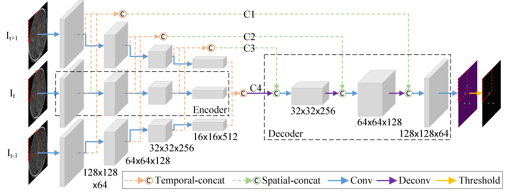
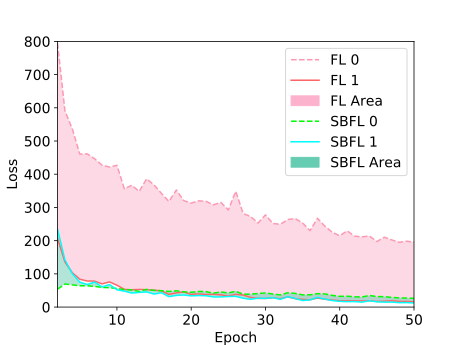

# Trident Segmentation CNN  
---Yalong Liu---  
[Arxiv Paper](https://arxiv.org/abs/1910.09773)  
Liu, Yalong, Jie Li, Miaomiao Wang, Zhicheng Jiao, Jian Yang, and Xianjun Li. "Trident Segmentation CNN: A Spatiotemporal Transformation CNN for Punctate White Matter Lesions Segmentation in Preterm Neonates." arXiv preprint arXiv:1910.09773 (2019).  

**Key words:** Deep Learning; Punctate white matter lesions (PWMLs); Brain tumor segmentation.

**Contributions:**  
**1.Trident Segmentation CNN** (Convert spatial information into temporal information, which reduces the consumption of computing resources.)   

<br>  


Fig. 1. A Deep Learning method to segment punctate white matter lesions (PWMLs).  
  
**2.Self-balancing Focal Loss** (Balancing the loss of different classes in class imbalance situation and boost the model performance.)  

  
<a href="https://www.codecogs.com/eqnedit.php?latex=\\SBF{L_0}&space;=&space;-&space;\left(&space;{1&space;-&space;{y_{pred}}}&space;\right)&space;\times&space;y_{pred}^\gamma&space;\times&space;\log&space;\left(&space;{1&space;-&space;{y_{pred}}&space;&plus;&space;\varepsilon&space;}&space;\right),\\\\&space;SBF{L_1}&space;=&space;-&space;{y_{pred}}&space;\times&space;{\left(&space;{1&space;-&space;{y_{pred}}}&space;\right)^\gamma&space;}&space;\times&space;\log&space;\left(&space;{{y_{pred}}&space;&plus;&space;\varepsilon&space;}&space;\right),\\\\&space;\beta&space;=&space;\frac{{0.4&space;\times&space;sum\left(&space;{SBF{L_0}}&space;\right)}}{{sum\left(&space;{SBF{L_0}}&space;\right)&space;&plus;&space;sum\left(&space;{SBF{L_1}}&space;\right)}}&space;&plus;&space;0.5,\\\\&space;SBFL&space;=&space;\beta&space;\times&space;SBF{L_1}&space;&plus;&space;\left(&space;{1&space;-&space;\beta&space;}&space;\right)&space;\times&space;SBF{L_0}," target="_blank"></a>  

Where SBFL<sub>0</sub>  and  SBFL<sub>1</sub> are the focal loss of background and foreground pixels without &alpha; . sum(SBFL<sub>0</sub>)  and sum(SBFL<sub>1</sub>)  are the sums of SBFL<sub>0</sub> and SBFL<sub>1</sub> . So sum(SBFL<sub>0</sub>)+sum(SBFL<sub>0</sub>)  represents the total loss of the model. Intuitively, we can use the ratio of SBFL<sub>0</sub>  and sum(SBFL<sub>0</sub>)+sum(SBFL<sub>0</sub>)   to balance the loss of  SBFL<sub>0</sub> and SBFL<sub>1</sub> . However, this may result in a sharp oscillation of the model parameters. In order to segment PWML, we will focus on the segmentation of the lesion areas when balancing the loss of positive and negative samples. That is,  &beta; should always be greater than 0.5. It also should ensure that the model does not only focus on the segmentation of positive areas, so we limit the maximum value of  &beta; to 0.9 by a coefficient of 0.4. Finally, the  SBFL is composed of  SBFL<sub>1</sub> weighted by &beta;  and  SBFL<sub>0</sub> weighted by 1-&beta;.(For more information, please refer to my [Arxiv paper](https://arxiv.org/abs/1910.09773))

**This repository includes:**  
1.T1WI of 10 patients for test(Full dataset is not allowed to be made public)  
2.Full code for model training and inference  
## Requirements
Python 3.6.3  
Tensorflow-gpu 1.12.0  
CUDA 9.0  
(tested ok on windows 10)
## Getting Started
1.Download the repositories.  
2.Choose a mode in the main.py('inference' or 'training').  
3.Change parameters in configs/pwml/config_TridentSegNet.py according to the comment  in the file.  
Enjoy!

## Acknowledgment
This repo borrows tons of code from  
[matterport/Mask_RCNN](https://github.com/matterport/Mask_RCNN)  
## Results
**1.Trident Segmentation CNN:**

N&nbsp;|Model|DSC|Sensitive|Specificity|Hausdorff<br> Distance|Notes
:-:|:-|:-:|:-:|:-:|:-:|:-
A|Mukherjee et al. [4]|0.4288|0.4533|0.9961|59.6432|A Triditional Method
B|Residual U-Net [7]|0.5838|0.6013|**0.9998**|44.7323| Residual U-Net (patch-based)
C|RS-RCNN [2]|0.5986|0.6535|**0.9998**|36.6065|Refined Segmentation R-CNN
D|TS-CNN|0.6024|0.6838|**0.9998**|30.9768|Proposed
E|TS-CNN (Data-aug)|0.6088|0.6838|**0.9998**|30.8133|+ data augmentation
F|TS-CNN (CC=64)|0.6186|0.6952|**0.9998**|28.3413|Double channel counts to 64
G|TS-CNN (SBFL)|**0.6355**|**0.7126**|**0.9998**|**24.5836**|Trained by Self-balancing Focal Loss

**2.Self-balancing Focal Loss:**  
  
Fig. 2. &nbsp;SBFL can balance the class0 loss and class1 loss in the training process to get better performance.  

---  
Table 1. Results on MR images

N&nbsp;|&nbsp; &nbsp; &nbsp; &nbsp;Original MR&nbsp;&nbsp;&nbsp; &nbsp; <br>images|Mukherjee et al. [4]|Residual U-Net [7]|&nbsp;  RS-RCNN [2]&nbsp; |Our Method  (TS-CNN)
:-|:-:|:-:|:-:|:-:|:-:|  

&nbsp;1&nbsp;|
:-|:-:|
&nbsp;2&nbsp;|  
&nbsp;3&nbsp;|  
&nbsp;4&nbsp;|
&nbsp;5&nbsp;|

-----
### Citation

If you use Trident Segmentation CNN in your research, please cite the paper ([Arxiv](https://arxiv.org/abs/1910.09773))

```
Liu, Yalong, Jie Li, Miaomiao Wang, Zhicheng Jiao, Jian Yang, and Xianjun Li. "Trident Segmentation CNN: A Spatiotemporal Transformation CNN for Punctate White Matter Lesions Segmentation in Preterm Neonates." arXiv preprint arXiv:1910.09773 (2019).
```


